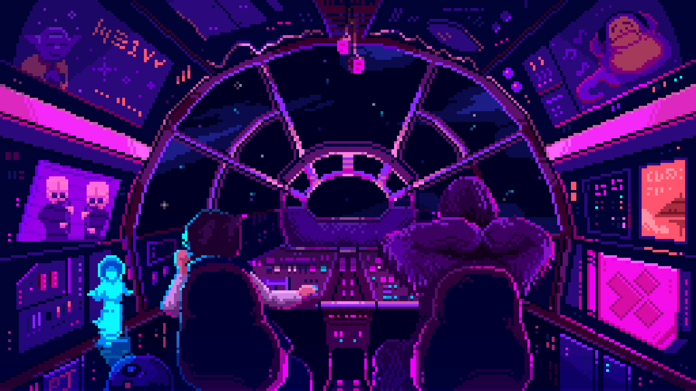

<h1 align="center">
  Seja bem vindo a minha jornada.
</h1>

  <!---->
  

<h3 align="center">
  Programador • Estudante de Engenharia de Software
</h3>

  
  
  
  

## &nbsp;Minha Stack

## &nbsp;Sobre Mim

-  &nbsp;Oi! Meu nome é Breno, sou estudante de Engenharia de Software e amante de diversas áreas da tecnologia.  
-  &nbsp;Meu foco atual é o aprendizado de Python e SQL.  
-  &nbsp;Minha maior paixão reside no mundo da IA, onde pretendo me especializar e atuar.  
-  &nbsp;Valorizo a construção de relacionamentos sólidos e a colaboração para alcançarmos ainda mais além.

## &nbsp;Contato

  
Créditos

   
  - GitHub Stats by <a href="https://github.com/anuraghazra/github-readme-stats">anuraghazra</a>
   
  - <a href="https://skillicons.dev"> Skill icons </a>
   
  - Animated emojis provided by <a href="https://github.com/Tarikul-Islam-Anik/Animated-Fluent-Emojis">Tarikul Islam Anik</a>

